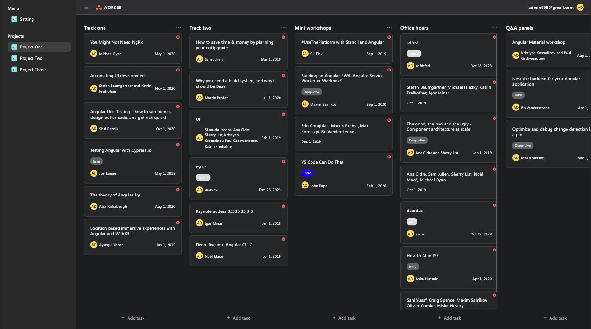
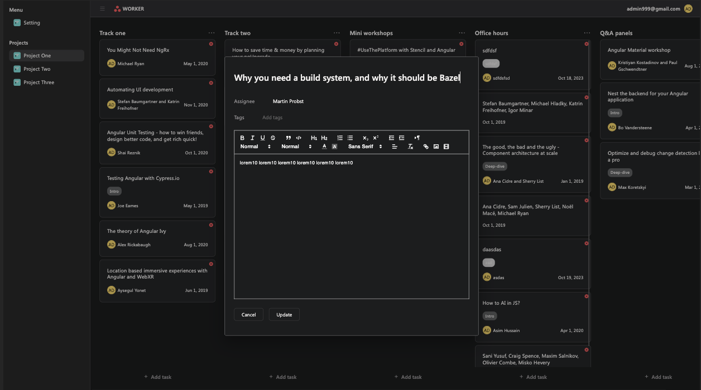
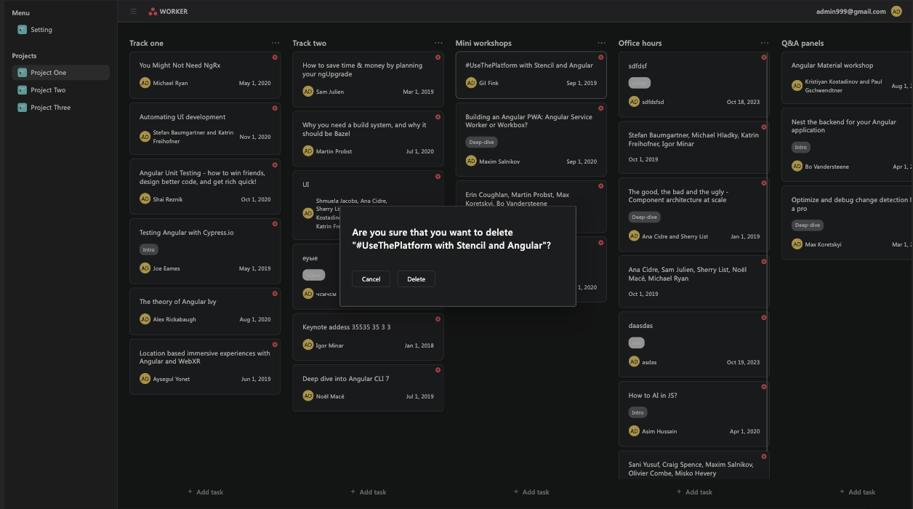

# Task Tracker Application (Asana clone) Angular 16

A simplified task tracking application, inspired by Asana, implemented using Angular.

## Key Features

- Edit boards, cards, and tracks.
- Add, delete, and update cards.
- Drag cards across tracks (lines on the board) in the style of Asana.
- Utilization of RxJS, NGRX for state management, and reactive programming.
- Use of the Angular Material library for styling the interface.

## Requirements

Authentication is required to make changes to the application. Login is facilitated through a backend running on Google Firebase.

## Technologies Used

- Angular: Used to build the user interface.
- RxJS: Provides reactive programming capabilities.
- NGRX: Used for state management.
- Angular Material: Library for styling the interface.
- Firebase: Used as the backend for authentication and data storage.

## Demo

Explore the live version of the application [HERE](https://asana-clone-app.web.app/).

## Screenshots

## Installation and Run Instructions

1. Clone the repository to your computer.
  git clone https://github.com/kulakovskyi/angular-asana-clone
2. Install dependencies using `npm install`.
3. Start the application with `ng serve`.
4. Open the application in your web browser at [http://localhost:4200/](http://localhost:4200/).

## 🚨 Important: Forking this Repository (Please Read!)

Thank you for considering the use of this code for your own website. Many individuals have reached out to inquire about utilizing this code, and generally, the answer is yes, with proper attribution.

I highly value the openness of my site's source code, but it's crucial to address the issue of plagiarism. It's disheartening to discover instances where someone has copied my site without giving due credit. Building and designing this iteration of my website required a substantial amount of effort, and I take pride in it. All I ask is for users to refrain from claiming this effort as their own.

Feel free to fork and build upon this code, but please be respectful of the effort invested and provide proper attribution.

## License

This project is licensed under the MIT License. See the [LICENSE.md](LICENSE.md). file for more information.

